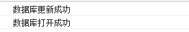
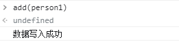
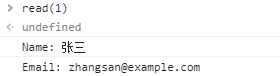
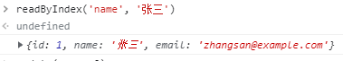
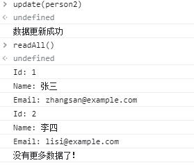
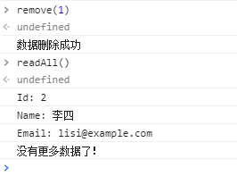

## 

## 一、IndexedDB 创建
> IndexedDB 是被正式纳⼊HTML5标准的数据库储存⽅案，它是NoSQL数据库，⽤键值对进⾏储存，可以进⾏快 速读取操作，⾮常适合web场景，同时⽤JavaScript进⾏操作会⾮常⽅便。

虽然小伙伴平时项目用到的不多，但了解它并会使用还是很有必要。以下是本人总结 IndexedDB 的常规使用方式.

#### 1. 判断当前浏览器环境是否支持
``` javascript  
var indexedDB = window.indexedDB || window.webkitIndexedDB || window.mozIndexedDB || window.msIndexedDB;
if(!indexedDB) {
  console.log("你的浏览器不支持IndexedDB");
}
```


#### 2. 打开数据库
> 有数据更新的时候，修改**版本号**参数。触发 IndexedDB 更新回调，来更新数据库。

``` javascript 
// 打开数据库 数据库名称 版本号
var requestDB = indexedDB.open('testDB', 9);

// 监听 IndexedDB 是否创建成功
var db;
requestDB.onsuccess = function (e) {
  db = requestDB.result;
  console.log('数据库打开成功');
};
requestDB.onerror = function (event) {
  console.log('数据库打开报错');
};

```


#### 3. 监听 IndexedDB 版本更新
> **新建**数据库和**更新**数据库时都能触发
1. **新建**数据库时，**新增**数据表。
2. **更新**数据库时，对数据表进行**更新**。

``` javascript
// 监听版本升级事件  
requestDB.onupgradeneeded = function (event) {
  console.log('数据库更新成功');

  db = event.target.result;
  // 新建数据库时-新建对象仓库（新建表）表名 'persionTable'
  var objStore;
  if (!db.objectStoreNames.contains('persionTable')) {
    // 创建新的存储对象  表名 { 主键, 是否自增(默认 false ) } 
    objStore = db.createObjectStore('persionTable', { ketPath: 'id', autoIncrement: true });
    // 新建索引 名称 属性 配置对象
    objStore.createIndex('id', 'id', { unique: false });
    objStore.createIndex('name', 'name', { unique: false });
    objStore.createIndex('email', 'email', { unique: true });
  }
}
```
效果图如下



## 二、 IndexedDB 实现 增、删、改、查

#### 1. IndexedDB 新增
``` javascript

var person1 = {
  id: 1,
  name: '张三',
  email: 'zhangsan@example.com'
}

// 新增数据
function add(person) {
  // 这里开启事务，传入的是一个数组，也就是说我们可以对多个对象存储进行操作
  var transaction = db.transaction(['persionTable'], 'readwrite');
  // 获取具体的对象存储
  var objectStore = transaction.objectStore('persionTable');
  var request = objectStore.add(person);
  // 写入数据的事件监听
  request.onsuccess = function (event) {
    console.log('数据写入成功');
  };

  request.onerror = function (event) {
    console.log('数据写入失败');
  }
}

// add(person1);
```

效果图如下


#### 2. IndexedDB 查找
``` javascript

// 读取数据--通过主键方式获取
function read(id) {
  var transaction = db.transaction(['persionTable']);
  var objectStore = transaction.objectStore('persionTable');
  var request = objectStore.get(id);

  request.onerror = function (event) {
    console.log('事务失败');
  };

  request.onsuccess = function (event) {
    if (request.result) {
      console.log('Name: ' + request.result.name);
      console.log('Email: ' + request.result.email);
    } else {
      console.log('未获得数据记录');
    }
  };
}

// read(1);

// 读取数据--通过索引方式获取
function readByIndex(key,value) {
    // 这里开启事务，传入的是一个数组，也就是说我们可以对多个对象存储进行操作
    var transaction = db.transaction(['persionTable'], 'readonly')
    // 获取具体的对象存储
    var objectStore = transaction.objectStore('persionTable')
    // 打开索引
    var new_key = objectStore.index(key)
    var result = new_key.get(value)
    // 写入数据的事件监听
    result.onsuccess = function(e){
        console.log(e.target.result)
    }
    result.onerror = function(e){
        console.log(e)
    }
}

// readByIndex('id', 1)


// 遍历数据
function readAll() {
  var transaction = db.transaction(['persionTable']);
  var objectStore = transaction.objectStore('persionTable');
  var request = objectStore.openCursor();

  request.onsuccess = function (event) {
    var cursor = event.target.result;

    if (cursor) {
      console.log('Id: ' + cursor.key);
      console.log('Name: ' + cursor.value.name);
      console.log('Email: ' + cursor.value.email);
      cursor.continue();
    } else {
      console.log('没有更多数据了！');
    }
  };
}

// readAll();
```
效果图如下




#### 3. IndexedDB 修改
``` javascript
// 更新数据
var person2 = {
  id: 1, 
  name: '李四', 
  email: 'lisi@example.com'
}

function update(person) {
  var transaction = db.transaction(['persionTable'], 'readwrite');
  var objectStore = transaction.objectStore('persionTable');
  var request = objectStore.put(person);

  request.onsuccess = function (event) {
    console.log('数据更新成功');
  };

  request.onerror = function (event) {
    console.log('数据更新失败');
  }
}

// update(person2);

```
效果图如下


#### 4. IndexedDB 删除
``` javascript
// 删除数据  要删除的主键 key 
function remove(id) {
  var transaction = db.transaction(['persionTable'], 'readwrite');
  var objectStore = transaction.objectStore('persionTable');
  var request = objectStore.delete(id);

  request.onsuccess = function (event) {
    console.log('数据删除成功');
  };

  request.onerror = function (event) {
    console.log('数据删除失败');
  }
}

// remove(1);

```
效果图如下



> 参考以前项目中使用的 IndexedDB 经验。如有遗漏，欢迎交流。