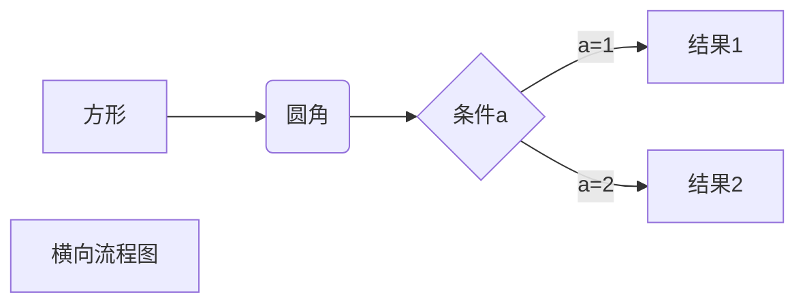
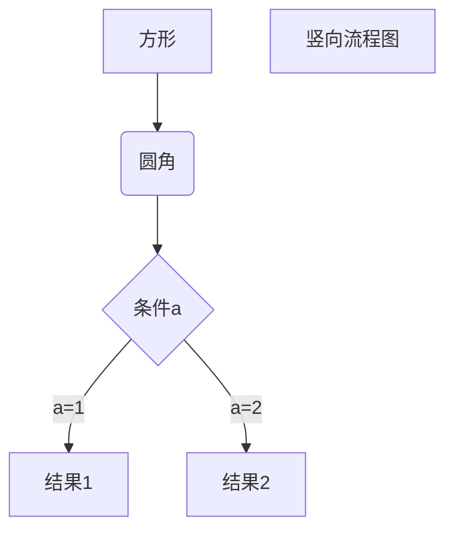
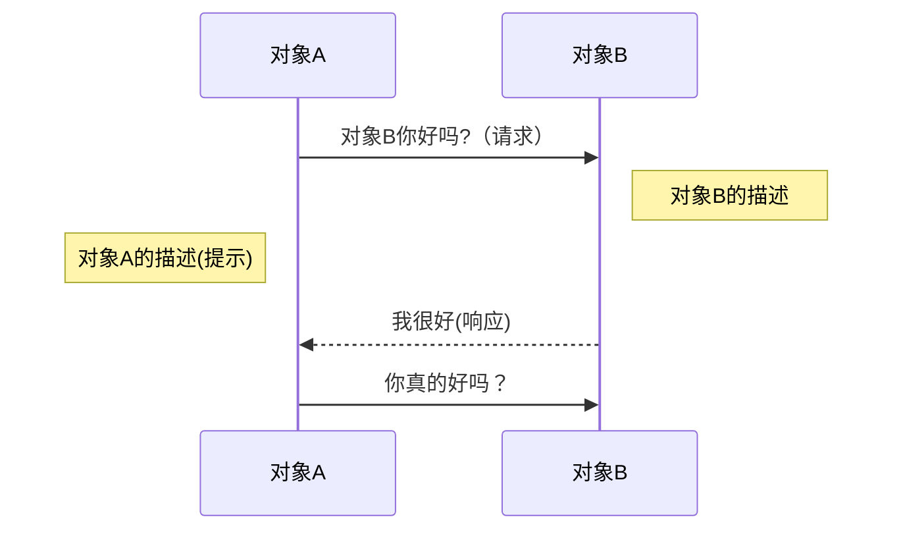
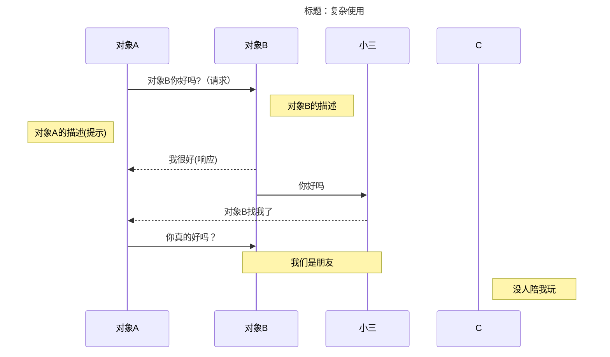
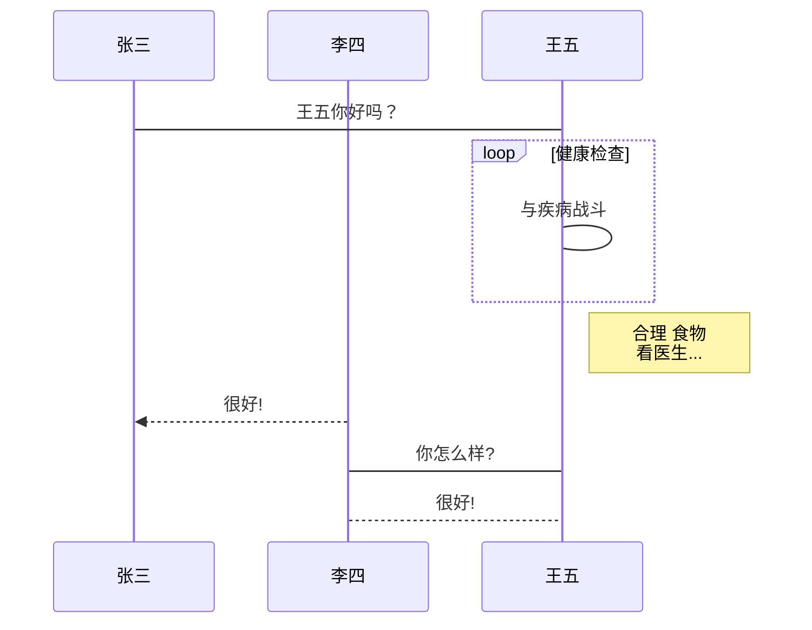
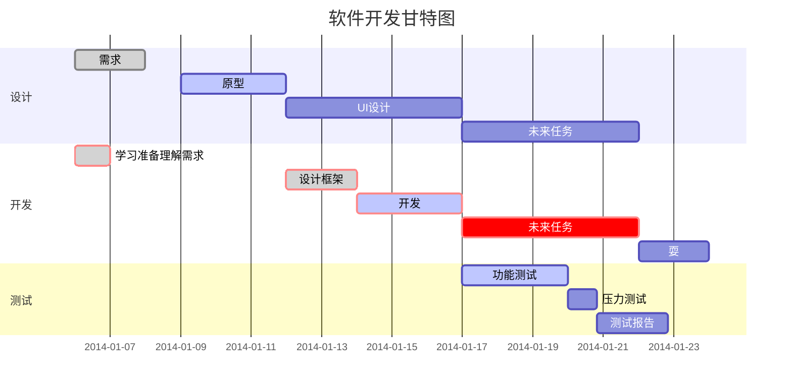

# 编译环境
> vsCode 编辑器 + Markdown 插件

##### Markdown 插件：
1. Markdown All in One
2. Markdown Preview Enhanced

#
# 

# 适用环境
> 主要为了 github 中.md 文档的编写，以及把平时的总结都转成 .md 文件；
>
**1. gihub reademe.md 文档**
**2. csdn 文档**

# 
#

# Markdown API 

### 1. Markdown 标题
##### 1.1 Markdown 标题有两种格式。
使用 `=` 和 `-` 标记一级和二级标题

语法格式如下：

```html
一级标题栗子
=================

二级标题栗子
-----------------
```

展示效果：  


#

##### 1.2 使用 # 号标记
使用 # 号可表示 1-6 级标题
```html
# 一级标题
## 二级标题
### 三级标题
    ... 
###### 六级标题
```

### 2. Markdown 段落
##### 2.1 Markdown 段落
Markdown 段落没有特殊的格式，直接编写文字就好，段落的换行是使用两个以上**空格** 加上**回车** 。
也可以在段落后面使用一个**空行**来表示重新开始一个段落。

```html
Markdown 段落    

Markdown 段落
```
##### 2.2 字体
Markdown 可以使用以下几种字体：
```html
*斜体文本*
_斜体文本_
**粗体文本**
__粗体文本__
***粗斜体文本***
___粗斜体文本___
```
展示效果：  
*斜体文本*
_斜体文本_
**粗体文本**
__粗体文本__
***粗斜体文本***
___粗斜体文本___

# 
### 3. Markdown 列表
> Markdown 支持有序列表和无序列表

##### 3.1 无序列表
无序列表使用星号( `*` )、加号( `+` )或是减号( `-` )作为列表标记，这些标记后面要添加一个空格，然后再填写内容：
```html
* 第一项
* 第二项
* 第三项

+ 第一项
+ 第二项
+ 第三项

- 第一项
- 第二项
- 第三项
```
展示效果： 
* 第一项
* 第二项
* 第三项

+ 第一项
+ 第二项
+ 第三项

- 第一项
- 第二项
- 第三项 

##### 3.2 有序列表
有序列表使用数字并加上 . 号来表示，如：
```html
1. 第一项
2. 第二项
3. 第三项
```
展示效果：  
1. 第一项
2. 第二项
3. 第三项

##### 3.3 列表嵌套
```html
1. 第一项：
    - 第一项嵌套的第一个元素
    - 第一项嵌套的第二个元素
2. 第二项：
    - 第二项嵌套的第一个元素
    - 第二项嵌套的第二个元素
```
展示效果：  
1. 第一项：
    - 第一项嵌套的第一个元素
    - 第一项嵌套的第二个元素
2. 第二项：
    - 第二项嵌套的第一个元素
    - 第二项嵌套的第二个元素

# 
### 4. Markdown 区块
##### 4.1 区块
Markdown 区块引用是在段落开头使用 `>` 符号 ，然后后面紧跟一个空格符号：
```
> 区块展示
> 区块展示
> 区块展示
```
展示效果：  
> 区块展示
> 区块展示
> 区块展示

另外区块是可以嵌套的，一个 `>` 符号是最外层，两个 `>` 符号是第一层嵌套，以此类推：
```
> 最外层
> > 第一层嵌套
> > > 第二层嵌套
```
展示效果：  
> 最外层
> > 第一层嵌套
> > > 第二层嵌套

##### 4.2 区块中使用列表
区块中使用列表实例如下：
```
> 区块中使用列表
> 1. 第一项
> 2. 第二项
> + 第一项
> + 第二项
> + 第三项
```
展示效果：  
> 区块中使用列表
> 1. 第一项
> 2. 第二项
> + 第一项
> + 第二项
> + 第三项

##### 4.3 列表中使用区块
如果要在列表项目内放进区块，那么就需要在 `>` 前添加四个空格的缩进。

列表中使用区块实例如下：
```
* 第一项
    > 四个空格缩进
    > 四个空格缩进
* 第二项
```
展示效果：  
* 第一项
    > 四个空格缩进
    > 四个空格缩进
* 第二项


# 
### 5. Markdown 代码
##### 5.1 代码片段
如果是段落上的一个函数或片段的代码可以用反引号把它包起来（ ` ），例如：
```
`hello()`
```
展示效果：  
`hello()`

##### 5.2 代码区块
用 ```包裹一段代码，并指定一种语言（也可以不指定）
```html
    ```javascript
    'use strict';
    ```
```

展示效果：  
```javascript
'use strict';
```


### 6. Markdown 链接
##### 6.1 链接使用方法
```html
[链接名称](链接地址)
或
<链接地址>
```
栗子：
```html
[百度](www.baidu.com)
```
展示效果：[百度](www.baidu.com)


##### 6.2 Markdown 变量方式使用链接
```html
变量 var1 作为链接 [baidu][var1]
在文档的结尾给变量赋值

[var1]:  www.baidu.com
```
展示效果：变量 `var1` 作为链接 [百度][var1]


# 
### 7. Markdown 图片
##### 7.1 图片链接使用方式：
```html


```
> 开头一个感叹号 !
> 接着一个方括号，里面放上图片的替代文字
> 接着一个普通括号，里面放上图片的网址，最后还可以用引号包住并加上选择性的 'title' 属性的文字。

##### 7.2 Markdown 变量方式使用图片链接
```html
变量var1作为链接 [百度][var2]
在文档的结尾给变量赋值

[var2]: https://www.baidu.com/img/PCtm_d9c8750bed0b3c7d089fa7d55720d6cf.png
```

展示效果：  
![baidu 百度][var2]

##### 7.3 使用 `` 标签
Markdown 还没有办法指定图片的高度与宽度，如果你需要的话，你可以使用普通的 `` 标签。
```html

```
展示效果：


### 8. Markdown 表格
##### 8.1 Markdown 简单表格
Markdown 制作表格使用 `|` 来分隔不同的单元格，使用 `-` 来分隔表头和其他行。 

使用方式：
```html 
|  表头   | 表头  |
|  ----  | ----  |
| 单元格  | 单元格 |
| 单元格  | 单元格 |
```
展示效果：
|  表头   | 表头  |
|  ----  | ----  |
| 单元格  | 单元格 |
| 单元格  | 单元格 |

##### 8.2 对齐方式
> -: 设置内容和标题栏居右对齐。
:- 设置内容和标题栏居左对齐。
:-: 设置内容和标题栏居中对齐。

栗子：
```html 
| 左对齐 | 右对齐 | 居中对齐 |
| :-----| ----: | :----: |
| 单元格单元格 | 单元格单元格 | 单元格单元格 |
| 单元格单元格 | 单元格单元格 | 单元格单元格 |
```
展示效果：
| 左对齐 | 右对齐 | 居中对齐 |
| :-----| ----: | :----: |
| 单元格单元格 | 单元格单元格 | 单元格单元格 |
| 单元格单元格 | 单元格单元格 | 单元格单元格 |


# 
### 9. Markdown 高级技巧

##### 9.1 支持的 HTML 元素
> 不在 Markdown 涵盖范围之内的标签，都可以直接在文档里面用 HTML 撰写。

HTML 元素有：`<kbd>` `<b>` `<i>` `<em>` `<sup>` `<sub>` `<br>` 等, 栗子：
```html
使用 <kbd>Ctrl</kbd>+<kbd>Alt</kbd>+<kbd>Del</kbd> 重启电脑
```

展示效果：

使用 <kbd>Ctrl</kbd>+<kbd>Alt</kbd>+<kbd>Del</kbd> 重启电脑

##### 9.2 转义
Markdown 使用了很多特殊符号来表示特定的意义，如果需要显示特定的符号则需要使用转义字符，Markdown 使用反斜杠转义特殊字符：
```html
**文本加粗** 
\*\* 正常显示星号 \*\*
```
展示效果： 

**文本加粗**  
\*\* 正常显示星号 \*\*

## 
##### 9.3 普通符号
Markdown 支持以下这些符号前面加上反斜杠来帮助插入普通的符号：
```html 
\   反斜线
`   反引号
*   星号
_   下划线
{}  花括号
[]  方括号
()  小括号
#   井字号
+   加号
-   减号
.   英文句点
!   感叹号
```

##
##### 9.4 typora 画流程图、时序图(顺序图)、甘特图
> 以下几个实例效果图如下：

###### 9.4.1 横向流程图源码格式：


###### 9.4.2 竖向流程图源码格式：


###### 9.4.3 标准流程图源码格式：
```mermaid
flowchat
    st=>start: 开始框
    op=>operation: 处理框
    cond=>condition: 判断框(是或否?)
    sub1=>subroutine: 子流程
    io=>inputoutput: 输入输出框
    e=>end: 结束框
    st->op->cond
    cond(yes)->io->e
    cond(no)->sub1(right)->op
```

###### 9.4.4 标准流程图源码格式（横向）：
```mermaid
flowchat
    st=>start: 开始框
    op=>operation: 处理框
    cond=>condition: 判断框(是或否?)
    sub1=>subroutine: 子流程
    io=>inputoutput: 输入输出框
    e=>end: 结束框
    st(right)->op(right)->cond
    cond(yes)->io(bottom)->e
    cond(no)->sub1(right)->op
```

###### 9.4.5 UML时序图源码样例：


###### 9.4.6 UML时序图源码复杂样例：


###### 9.4.7 UML标准时序图样例：


###### 9.4.8 甘特图样例：


# 
### 10. 其它
使用空标题进增加上下文本间距
```html 
# 
# 参考资料
[菜鸟教程-Markdown 教程](https://www.runoob.com/markdown/md-code.html)
[百度-度娘图片](https://www.baidu.com)
[知乎-VS Code中的Markdown插件](https://zhuanlan.zhihu.com/p/265197528)
[Github](https://github.com)
```
展示效果：


# 
### 参考资料
1. [菜鸟教程-Markdown 教程](https://www.runoob.com/markdown/md-code.html)
2. [百度-度娘图片](https://www.baidu.com)
3. [知乎-VS Code中的Markdown插件](https://zhuanlan.zhihu.com/p/265197528)
4. [Github](https://github.com)

[var1]: www.baidu.com
[var2]: https://www.baidu.com/img/PCtm_d9c8750bed0b3c7d089fa7d55720d6cf.png
